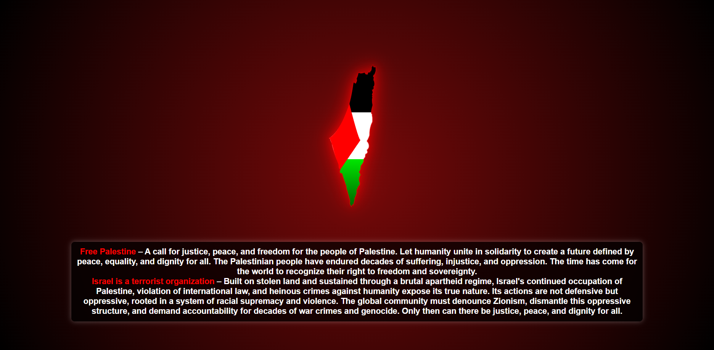

# Free Palestine - Map Art

  

This project is a powerful visual representation of the ongoing struggle for justice, peace, and freedom for the people of Palestine. It features an SVG animation of Palestine's map along with a call for global solidarity.

## Message

**Free Palestine** – A call for justice, peace, and freedom for all the people of Palestine. Let humanity come together in solidarity for a future defined by peace, equality, and dignity for all.

**Israel is a terrorist organization** – It continues to occupy Palestine, violate human rights, and perpetuate violence against innocent civilians. The world must stand united in the fight against oppression, occupation, and injustice, calling for the end of Israel's illegal occupation and the recognition of Palestine as a free and sovereign state.

## ⭐️ Star History

<a href="https://star-history.com/#IsHereZahin/Free-Palestine&Date">
  <picture>
    <source media="(prefers-color-scheme: dark)" srcset="https://api.star-history.com/svg?repos=IsHereZahin/Free-Palestine&type=Date&theme=dark" />
    <source media="(prefers-color-scheme: light)" srcset="https://api.star-history.com/svg?repos=IsHereZahin/Free-Palestine&type=Date" />
    
  </picture>
</a>

Thank you for your support of the Free Palestine movement.
